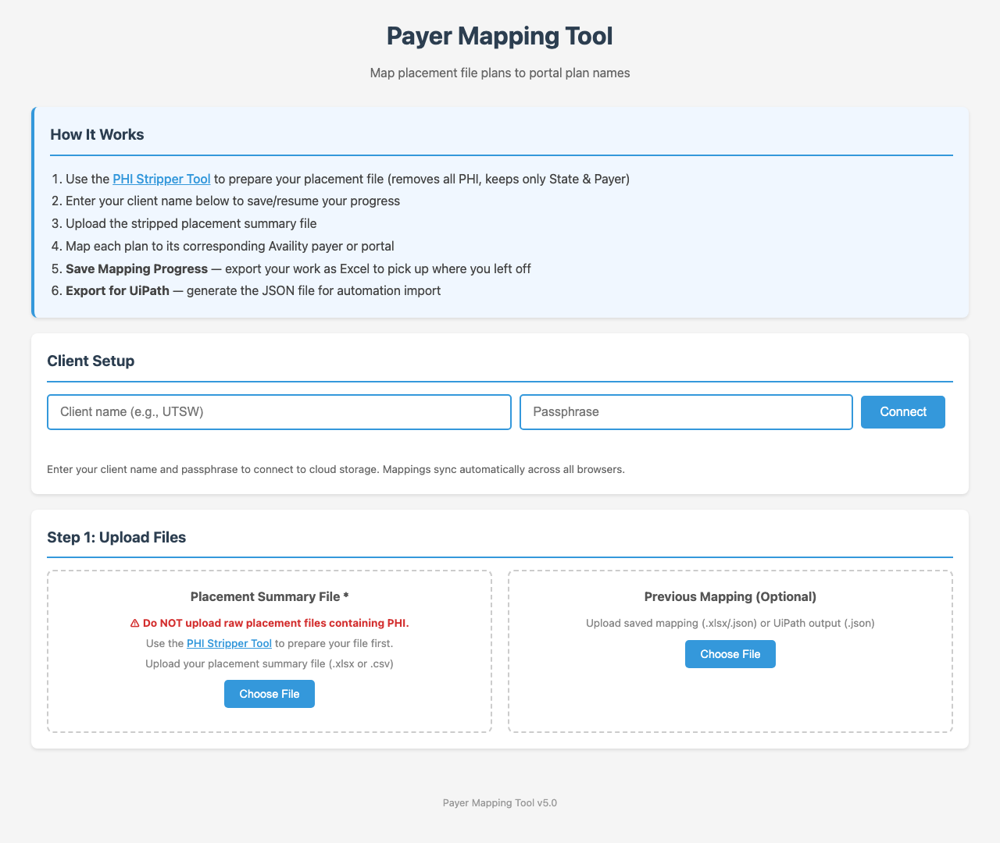
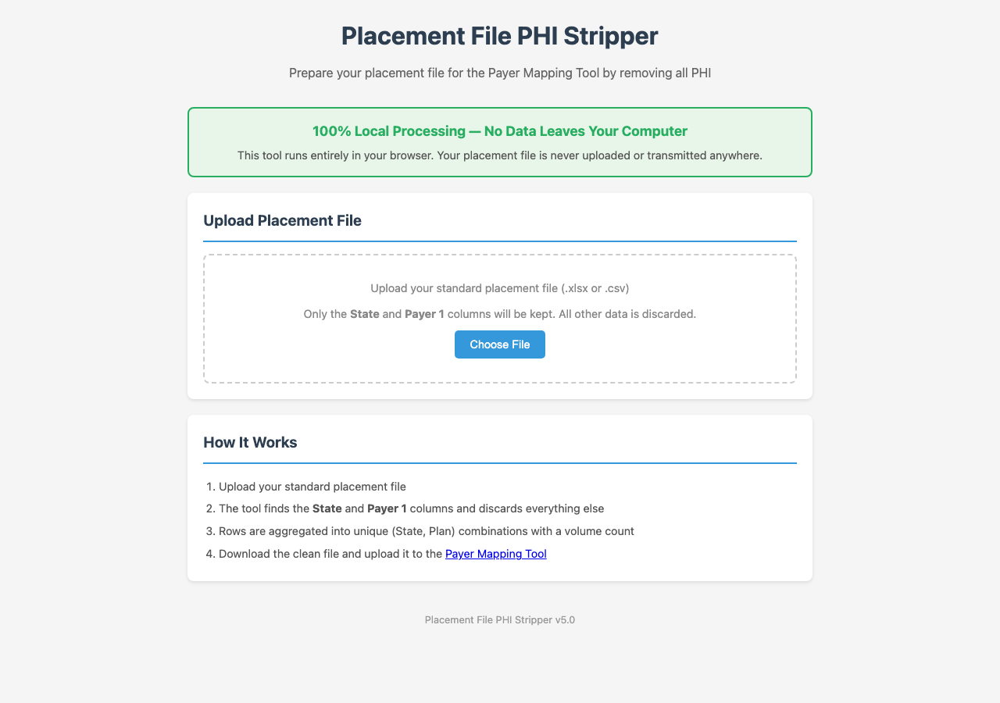

\newpage

# 1. Overview

The Payer Mapping Tool helps operations staff map placement file plans to their corresponding Availity payer names or portal destinations. This mapping is used to generate configuration files for UiPath automation.

The typical weekly workflow is:

1. Strip PHI from your raw placement file using the PHI Stripper tool
2. Connect to your client account in the Payer Mapping Tool
3. Upload the clean placement summary file
4. Map each plan to its Availity payer or portal
5. Save your mapping progress (Excel backup)
6. Export the UiPath JSON file for automation

{ width=85% }

\newpage

# 2. Getting Started

Access the tool at:

**<https://payer-mapping.visiquate.com>**

Requirements:

- Modern web browser (Chrome, Edge, or Firefox recommended)
- Internet connection (required for login and cloud sync)
- Your client name and passphrase (provided by your admin)
- A placement file that has been processed through the PHI Stripper

Additional pages:

- **PHI Stripper:** <https://payer-mapping.visiquate.com/phi_stripper.html>
- **Admin Dashboard:** <https://payer-mapping.visiquate.com/admin.html>

\newpage

# 3. Step 1: Strip PHI from Your Placement File

**IMPORTANT: Never upload a raw placement file containing PHI to the Payer Mapping Tool. Always use the PHI Stripper first.**

The PHI Stripper is a separate tool that removes all personal health information from your placement file, keeping only the State and Payer columns needed for mapping.

Access the PHI Stripper at:

**<https://payer-mapping.visiquate.com/phi_stripper.html>**

## How to use the PHI Stripper:

1. Open the PHI Stripper tool in your browser
2. Click "Choose File" and select your raw placement file (.xlsx or .csv)
3. The tool will process the file locally — no data leaves your computer
4. Review the summary showing original vs. output statistics
5. Click "Download Clean File (.xlsx)" to save the stripped file
6. The clean file will be named "[YourFileName]_clean.xlsx"

{ width=85% }

**Privacy Note:** The PHI Stripper runs 100% in your browser. Your placement file is never uploaded or transmitted anywhere. All processing happens locally on your computer.

\newpage

# 4. Step 2: Connect to Your Client

After opening the Payer Mapping Tool, connect to your client account:

1. Enter your client name (e.g., "UTSW") in the Client Name field
2. Enter your passphrase in the Passphrase field
3. Click "Connect"

After connecting, you will see one of these status messages:

| Status | Meaning |
|--------|---------|
| **Connected — Loaded X mappings** | Existing client with saved mappings in cloud |
| **Connected — New client** | First time using this client name |

{ width=85% }

**Tip:** Use the exact same client name each time. Mappings sync automatically across all browsers when connected to the cloud.

**Note:** Client names and passphrases are created by your admin. If you don't have one, contact your admin to set up your account.

\newpage

# 5. Step 3: Upload Files

## Placement Summary File (Required)

Upload the clean file you created with the PHI Stripper:

1. Click "Choose File" under "Placement Summary File"
2. Select your _clean.xlsx file
3. The tool will analyze the file and display all unique plans grouped by state

{ width=85% }

If you accidentally upload a raw placement file with PHI columns, the tool will reject it and ask you to use the PHI Stripper first.

## Previous Mapping (Optional)

If you have a saved mapping file from a previous session, upload it to pre-populate your mappings:

1. Click "Choose File" under "Previous Mapping (Optional)"
2. Select one of these file types:
   - Saved mapping progress (.xlsx) — from the "Save Mapping Progress" button
   - UiPath output (.json) — from the "Export for UiPath" button

## Page Schema File (Optional)

If you have a custom page schema file, upload it to override the default page layout types used in the UiPath export:

1. Click "Choose File" under "Page Schema (Optional)"
2. Select your JSON schema file

\newpage

# 6. Step 4: Map Payers

After uploading your placement file, the mapping interface appears with plans organized by state.

For each plan:

1. Find the plan in the list (use the search box to filter by name)
2. Click the dropdown next to the plan name
3. Select the appropriate Availity payer from the list
4. Your selection is saved automatically

{ width=85% }

## Visual Indicators

| Row Color | Meaning |
|-----------|---------|
| **Green** | Mapped to an Availity payer |
| **Orange** | Mapped to a non-Availity portal (UHC, Cigna, etc.) or "Not In Availity" |
| **Default** | Not yet mapped |

## Filters & Search

Use these tools to focus your work:

- **All** — Shows all plans
- **Mapped** — Shows plans mapped to Availity payers
- **Not In Availity** — Shows plans mapped to alternative portals
- **Unmapped** — Shows only plans you haven't mapped yet
- **Search box** — Type to filter plans by name

{ width=85% }

## Progress Statistics

The Mapping Progress section shows:

- **Total Plans** — Number of unique plan + state combinations
- **Mapped** — How many are mapped to Availity payers
- **Not In Availity** — How many are mapped to alternative portals
- **Unmapped** — How many still need mapping
- **States** — Number of different states in your file
- **Progress bar** — Visual percentage of completion

{ width=85% }

## Auto-Save

Every mapping change is saved automatically to the cloud within 2 seconds. You'll see a brief "Saved to cloud" indicator when this happens. There is no need to manually save your work — just map and go.

\newpage

# 7. Step 5: Export Your Work

## Save Mapping Progress (Recommended)

Click "Save Mapping Progress" to download your current mappings as an Excel file. This file can be re-imported later using the "Previous Mapping" upload if needed.

File name: `[ClientName]_mapping_v6.0_[date].xlsx`

## Export for UiPath (Required for Automation)

When you've finished mapping, click the green "Export for UiPath (.json)" button. This generates the JSON configuration file your automation team needs.

File name: `[ClientName]_uipath_v6.0_[date].json`

{ width=85% }

**Note:** Plans mapped to non-Availity portals (UHC, Cigna, HPN, etc.) and "Not In Availity" are automatically excluded from the UiPath export — only Availity-mapped plans are included.

\newpage

# 8. Special Payer Options

At the top of each payer dropdown, you'll find these special options:

| Option | When to Use |
|--------|-------------|
| **Not In Availity** | Payer is not available in Availity and cannot be processed through any portal |
| **Cigna Portal** | Payer should be processed through the Cigna portal |
| **HPN Portal** | Payer should be processed through the HPN portal |
| **OptumCare Portal** | Payer should be processed through the OptumCare portal |
| **Superior Portal** | Payer should be processed through the Superior portal |
| **UHC Portal** | Payer should be processed through the UHC portal |
| **UMR Portal** | Payer should be processed through the UMR portal |

**Important:** Plans mapped to these special options are excluded from the UiPath JSON export. They appear with an orange background in the mapping interface.

\newpage

# 9. Tips & Troubleshooting

## Common Questions

**Q: Why did my file get rejected?**

A: The tool rejected your file because it detected PHI columns (e.g., PatientFirstName, DOB, MemberID). Use the PHI Stripper tool first to remove all PHI, then upload the clean file.

**Q: Why are my previous mappings not showing?**

A: Plan names must match exactly between the placement file and the mapping file. If your placement file has different plan names than your saved mapping, they won't auto-match.

**Q: What browsers are supported?**

A: Chrome, Edge, and Firefox are recommended. Safari may work but is not fully tested.

**Q: Why do I see the same plan in multiple states?**

A: Each state may have different Availity payer options. The same plan name in Texas might map to a different Availity ID than in California.

**Q: I see "Cannot connect" when I try to log in.**

A: Check your internet connection. The tool requires an active connection to log in and sync data. If you previously logged in on this browser, you may be able to work offline temporarily — but a fresh login requires a connection.

**Q: How do I switch between dark and light mode?**

A: Click the sun/moon icon in the top-right corner of any page. Your preference is saved automatically.

\newpage

# 10. PHI & Security

- The PHI Stripper runs 100% locally in your browser — no data is transmitted
- The Payer Mapping Tool stores only plan names and payer mappings in the cloud — no patient data
- Raw placement files with PHI columns are automatically rejected by the mapping tool
- All file processing (reading spreadsheets, generating exports) happens in your browser
- Cloud storage contains only: client name, payer mappings, and timestamps
- Your passphrase is hashed before storage — it is never stored in plain text
- All data is transmitted over encrypted HTTPS connections
- Access is logged for security and compliance purposes

**Remember:** Always use the PHI Stripper before uploading any placement file to the Payer Mapping Tool.
